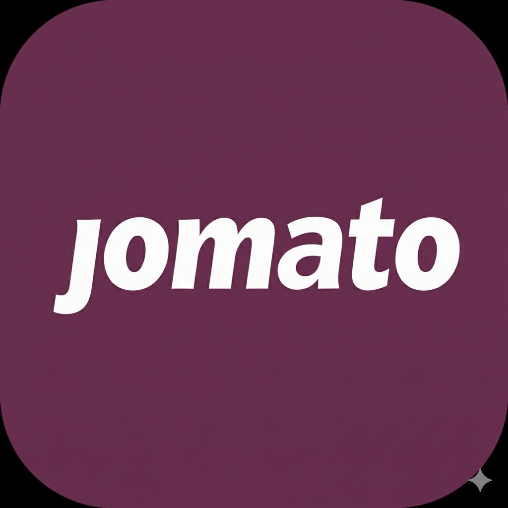

  
  
  # Jomato
  
  **The Unofficial Zomato Client & Food Rescue Monitor**
  
  

    <a href="#-download">Download App</a> •
    <a href="#-features">Features</a> •
    <a href="#-how-to-install">Installation Guide</a>
  

  

---

## 🚀 About The Project

**Jomato** is an unofficial, reverse-engineered client for Zomato. It is designed to provide utility features that power users need but the official app doesn't prioritize.

### 🍕 Key Feature: Instant Food Rescue Notifications

The "Food Rescue" initiative is great for saving money and preventing waste, but the deals vanish in seconds.

**Jomato solves this:**
* **Real-time Monitoring:** Jomato listens for Food Rescue events in your area.
* **Instant Alerts:** Get a notification the *second* a restaurant lists a rescue basket.
* **Direct Access:** Tap the notification to jump straight to the deal (before it sells out).

---

## 📥 How to Install

Since Jomato is an unofficial tool and not on the Google Play Store, your phone will try to block the installation. **This is normal.**

1.  **Download the APK:**
    * Go to the [**Releases Page**](../../releases).
    * Download the latest file (e.g., `Jomato-v1.0.apk`).

2.  **Open the File:**
    * Tap the downloaded file to install.

3.  **Bypass Play Protect:**
    * You will likely see a scary pop-up saying **"Unsafe App Blocked"** or **"Unknown Developer"**.
    * Click **"More Details"** (or the small arrow).
    * Click **"Install Anyway"**.

> **Note:** This warning appears because the app is signed with a personal key and hasn't been reviewed by Google. The code is open source here for you to verify.

---

## 🛠️ Tech Stack

* **Android:** Native Android (Kotlin/Java)
* **Network:** Retrofit / OkHttp for API interception
* **Architecture:** Reverse-engineered Zomato Internal API

---

## ⚠️ Disclaimer & Legal

**This project is for Educational Purposes Only.**

* This application is **not affiliated with, endorsed by, or connected to Zomato** in any way.
* "Zomato" and the Zomato logo are trademarks of Zomato Ltd.
* The use of this software is done at your own discretion and risk. The developer is not responsible for any bans or account restrictions imposed by the official service provider.

---

  Built with ❤️ by [Your Name]

